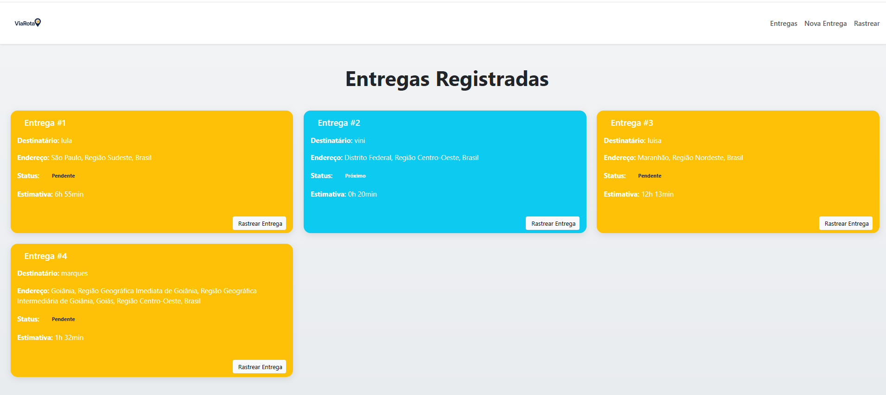
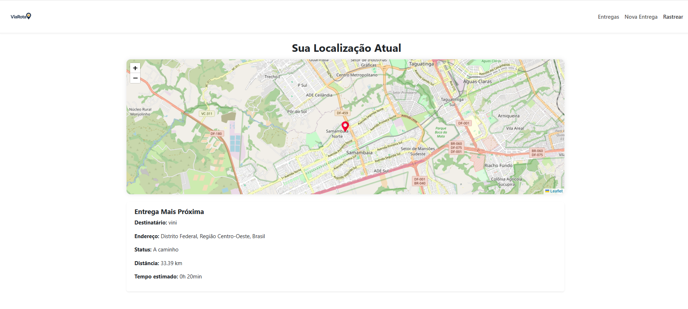

# 📦 ViaRota — Sistema Inteligente de Entregas

O **ViaRota** é um sistema moderno de rastreamento de entregas, desenvolvido com **React**, **Bootstrap** e **Leaflet**, combinando uma interface elegante com funcionalidades robustas de geolocalização. oferece uma experiência fluida e visualmente impactante para o usuário final.

---

## ✨ Funcionalidades

- 📍 Rastreamento de entregas em tempo real no mapa
- 🚚 Estimativa de tempo baseada em geolocalização atual
- 🧭 Cards dinâmicos e responsivos com ícones e status visuais
- 🧾 Cadastro inteligente com sugestões automáticas de endereço
- 🖥️ Layout 100% responsivo com design moderno e premium

---

## 📸 Pré-visualizações

### Tela Inicial com Cards Inteligentes


### Tela de Rastreamento em Tempo Real


---

## 🧪 Tecnologias Utilizadas

- ⚛️ React + Vite
- 🗺️ React Leaflet + Leaflet Routing Machine
- 🎨 Bootstrap 5 + Bootstrap Icons
- 🌐 OpenStreetMap (geolocalização e rotas)
- 📦 localStorage (simulação de banco de dados)

---

## 🚀 Como rodar localmente

```bash
# Clone o repositório
git clone https://github.com/Viniciusmqs/sistema-entregas.git
cd sistema-entregas

# Instale as dependências
npm install

# Execute o projeto
npm run dev

👨‍💻 Autor
Desenvolvido por Vinicius Marques

📄 Licença
Este projeto está sob a licença MIT.
